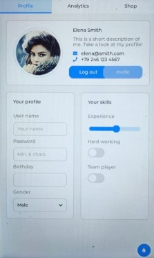

This example utilises a Guition 4.3-inch screen, model number: JC4880P433C Please use the Arduino ESP32 version 3.2.1. Arduino IDE 2.3.4

#lvgl v9.4.0

Move the demos folder from within the lvgl folder to the src folder in the same directory.

NOTE: to get the touch working from the supplied sketch I have changed file pins_config.h

#define TP_INT 21 // previously -1

(GitHub needs to fix how to upload subfolders and images plus sizing of images.)

.. image:: [(https://github.com/buccaneer-jak/JC4880P433C-lvgl_v9_sw_portrait/blob/main/images/PXL_20251121_175642478.jpg)
   :height: 100px
   :width: 200 px
   :scale: 50 %

